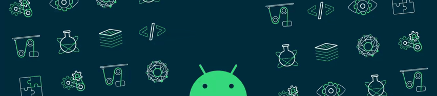

<!------------------------------------------------------------------------------------------------------------------------------------------------------------------------------------------------------------------------------------------------->

<!------------------------------------------------------------------------------------------------------------------------------------------------------------------------------------------------------------------------------------------------->
<h1 align=center>  Hi, Hritesh Saha here </h1>
<!------------------------------------------------------------------------------------------------------------------------------------------------------------------------------------------------------------------------------------------------->

  
  &nbsp;&nbsp;&nbsp;
  

  <!------------------------------------------------------------------------------------------------------------------------------------------------------------------------------------------------------------------------------------------------->
 
 
<!------------------------------------------------------------------------------------------------------------------------------------------------------------------------------------------------------------------------------------------------->

<strong><samp>「</samp></strong>
 
  

    <samp>
        <b>I turn innovative ideas into engaging digital experiences.  Let's build something remarkable together.</b>
        
        <image src="https://readme-typing-svg.herokuapp.com?font=Iosevka&size=16&color=97a4e2&center=true&width=410&height=45&repeat=false&lines=Full+stack+web+developer">
    </samp>
  

<strong><samp>」</samp></strong>

 
<!------------------------------------------------------------------------------------------------------------------------------------------------------------------------------------------------------------------------------------------------->
<h1 align=center></h1>

&nbsp;&nbsp;&nbsp;&nbsp;&nbsp;&nbsp;&nbsp;&nbsp;&nbsp;
 

&nbsp;&nbsp;&nbsp;&nbsp;&nbsp;&nbsp;&nbsp;&nbsp;&nbsp;&nbsp;&nbsp;&nbsp;&nbsp;&nbsp;&nbsp;&nbsp;&nbsp;&nbsp;&nbsp;&nbsp;&nbsp;&nbsp;&nbsp;&nbsp;&nbsp;&nbsp;&nbsp;&nbsp;&nbsp;&nbsp;&nbsp;&nbsp;&nbsp;&nbsp;&nbsp;&nbsp;&nbsp;&nbsp;&nbsp;&nbsp;&nbsp;&nbsp;&nbsp;&nbsp;&nbsp;&nbsp;&nbsp; 
<!------------------------------------------------------------------------------------------------------------------------------------------------------------------------------------------------------------------------------------------------->
<h2 align=center> Tech Stack </h2>
    
#### Languages: 

<!------------------------------------------------------------------------------------------------------------------------------------------------------------------------------------------------------------------------------------------------->
#### Framework

<!------------------------------------------------------------------------------------------------------------------------------------------------------------------------------------------------------------------------------------------------->
#### Embedded Systems:

<!------------------------------------------------------------------------------------------------------------------------------------------------------------------------------------------------------------------------------------------------->
#### Database:

<!------------------------------------------------------------------------------------------------------------------------------------------------------------------------------------------------------------------------------------------------->
#### DevOps:

<!------------------------------------------------------------------------------------------------------------------------------------------------------------------------------------------------------------------------------------------------->
<h1></h1>

<h1></h1>
<!------------------------------------------------------------------------------------------------------------------------------------------------------------------------------------------------------------------------------------------------->

[linkedin]: https://www.linkedin.com/in/hritesh-saha/
[gmail]:mailto:hriteshsaha4@gmail.com
<!------------------------------------------------------------------------------------------------------------------------------------------------------------------------------------------------------------------------------------------------->
